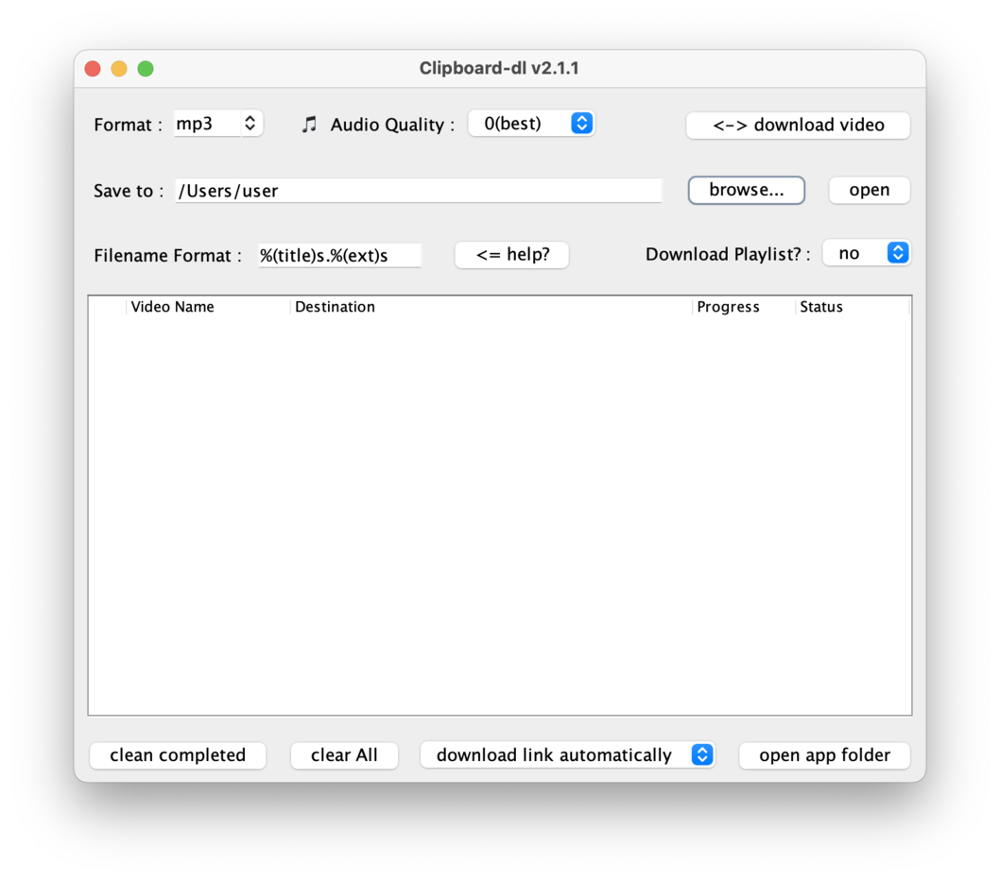

# Clipboard-dl [](https://github.com/awidesky/Youtube-Clipboard-Auto-Downloader4J/releases/latest) [](./LICENSE)




Automatically grab Youtube video link from clipboard, and download in whatever format you want!  
Just copy a link with `ctrl + c` or `command + c` and you'll get audio/video file in any format you chose!


## Installation

Binaries can be found in [release](https://github.com/awidesky/Youtube-Clipboard-Auto-Downloader4J/releases/latest).    
File|Description
:---|:---
[Clipboard-dl.zip](https://github.com/awidesky/Youtube-Audio-Auto-Downloader4J/releases/latest/download/Clipboard-dl.zip)|Cross-platform executable jar file
[Clipboard-dl.msi](https://github.com/awidesky/Youtube-Audio-Auto-Downloader4J/releases/latest/download/Clipboard-dl.msi)|Windows installer
[Clipboard-dl.pkg](https://github.com/awidesky/Youtube-Audio-Auto-Downloader4J/releases/latest/download/Clipboard-dl.pkg)|MacOS installer
[clipboard-dl_amd64.deb](https://github.com/awidesky/Youtube-Clipboard-Auto-Downloader4J/releases/latest/download/clipboard-dl_amd64.deb)|Linux debian installer
[Clipboard-dl_launch4j.zip](https://github.com/awidesky/Youtube-Audio-Auto-Downloader4J/releases/latest/download/Clipboard-dl_launch4j.zip)|Windows standalone exe packaged by [launch4j](https://launch4j.sourceforge.net/)
[Clipboard-dl_launch4j_jre.zip](https://github.com/awidesky/Youtube-Audio-Auto-Downloader4J/releases/latest/download/Clipboard-dl_launch4j_jre.zip)|Windows standalone exe **including JRE** packaged by [launch4j](https://launch4j.sourceforge.net/)


Binary type|Supported OS
:---|:---
Native installer([jpackage](https://docs.oracle.com/en/java/javase/17/docs/specs/man/jpackage.html))|[](https://github.com/awidesky/Youtube-Clipboard-Auto-Downloader4J/releases/latest) [](https://github.com/awidesky/Youtube-Clipboard-Auto-Downloader4J/releases/latest) [](https://github.com/awidesky/Youtube-Clipboard-Auto-Downloader4J/releases/latest)
Runnable Jar|[](https://github.com/awidesky/Youtube-Clipboard-Auto-Downloader4J/releases/latest) [](https://github.com/awidesky/Youtube-Clipboard-Auto-Downloader4J/releases/latest) [](https://github.com/awidesky/Youtube-Clipboard-Auto-Downloader4J/releases/latest)
[Launch4j](https://launch4j.sourceforge.net) executable|[](https://github.com/awidesky/Youtube-Clipboard-Auto-Downloader4J/releases/latest)


## Features

* Automatic clipboard listening
	* `Clipboard-dl` automatically checks the user clipboard, and if copied text is a  video link, the download will start right away.
	* You can set to stop listening clipboard, or to ask before download with combobox in the lower part of window.
* Various options
	* Audio/Video file extension, quality, and file name format can be configured in the upper part of window.
	* Please refer to [here](https://github.com/yt-dlp/yt-dlp#output-template) for supported options.
* Playlist download
	* `Clipboar-dl` can download entire playlist by just copying a link of any one of the videos in the playlist.
	* If you want to download specific single video only, select "no" for `Download Playlist?` combobox.
* Download video/audio from other websites  
	* Every sites that [yt-dlp supports](https://github.com/yt-dlp/yt-dlp/blob/master/supportedsites.md) should work.
* Dependency management
	* `Clipboard-dl` uses [yt-dlp](https://github.com/yt-dlp/yt-dlp) to download videos, and `yt-dlp` uses `ffmpeg`.
	* `Clipboard-dl` searches for those dependencies, and it convenietly installs them if they don't exist.
		* In `Windows` and `Linix`, `ffmpeg` and `yt-dlp` are installed in [app folder](https://github.com/awidesky/ProjectPath?tab=readme-ov-file#results-in-macos)(click `open app folder` button to open it in system explorer).
		* In `MacOS`, both dependency will be installed via homebrew command.
	* Because of frequent bugfixes in [yt-dlp](https://github.com/yt-dlp/yt-dlp/releases), updating it regulary is suggested. `Clipboard-dl` looks for `yt-dlp` update every 10 days, and the duration can be changed by modefying `config.txt` in the app folder(look for `yt-dlp update (days)`).

## COMMAND LINE USAGE

Installing native binaries from [release](https://github.com/awidesky/Youtube-Clipboard-Auto-Downloader4J/releases) is recommended.
If it doesn't work, use `.jar` file in shell instead.

```
Usage : java -jar Clipboard-dl.jar [options]

Options :
	--help : show this help info.
	--version : show version info.
	--logbyTask : Logs from a task is gathered till the task is done/terminated.
	              Useful when you don't want to see dirty log file when multiple tasks running.
	--logTime : Log with TimeStamps
	--logOnConsole : Write log in command line console, not in a log file.
	--verbose : Print verbose logs(like GUI Windows or extra debug info, etc.)
	--ytdlpArgs=<options...> : Add additional yt-dlp options(listed at https://github.com/yt-dlp/yt-dlp#usage-and-options)
	                           that will be appended at the end(but before the url) of yt-dlp execution.
	                           If your options contains space, wrap them with ""
	                           If you need multiple options, wrap them with ""


Exit codes :
	   0 : Program exited successfully as user intended
	 200 : Failed to find ffmpeg installation
	 300 : Failed to find yt-dlp installation
	  -1 : Invalid command line argument(s)
	  -2 : Task execution from GUI event dispatch thread has failed
	-100 : Unknown Error(e.g. unhandled Exception/JVM Error)
```
